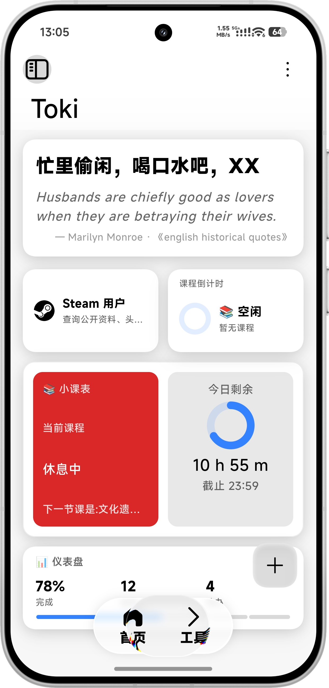
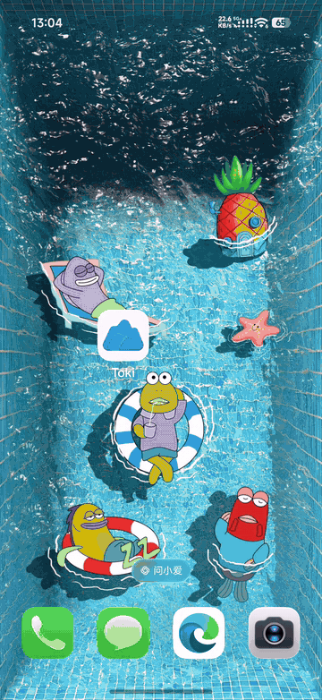

<p align="center">
  
</p>

# Toki（箱具工 → Toki）

**Miuix 风格工具箱（个人使用为主，目前还是早期版本功能不多）** · Flutter 应用，Android 11+ / Web

Toki 是一个以 **MIUI / Miuix 设计语言**打造的个人效率工具箱：首页仪表盘、课程倒计时、课表管理、每日一言，以及可扩展的「工具页」（**26 个 UAPI 实用工具 / 14 分类**：Steam/MC 查询、必应壁纸、二维码、IP、一言、MD5/Base64/AES、时间戳/农历、翻译、热榜、菜谱、搜索等）。界面全部基于 [flutter_miuix](https://pub.dev/packages/flutter_miuix) 组件（禁用 Material 视觉），追求 MIUI 原生质感与低功耗（Skia 渲染，Impeller 关闭）。

下载方式：GitHub/蓝奏云:    https://wwami.lanzouq.com/b01giad8ha      密码:e70o


> 本仓库为项目开源镜像版本，同步自内部开发主线（当前 v1.35.2）。

---

## ✨ 特性

| 模块 | 说明 |
| :--- | :--- |
| **首页网格** | 问候语 + 每日一言（多 API 免注册）、今日剩余仪表盘、课程倒计时；卡片网格**拖拽排序**、**长按编辑态一键移除**、响应式 2/3/4 列 |
| **课表** | 周网格大课表编辑、Excel 导入（.xls/.xlsx）、16 节次时间表、当前/下一节自动判定 |
| **每日活动** | 每日起止时间编辑（默认 09:00–18:00）、今日剩余进度 |
| **工具页** | 工具目录 JSON 外部化（`assets/tools/tools.json`，**加新工具零代码**）、14 分类折叠分组；**Steam 用户查询**定制页（4 格式识别）；通用工具页 `/tool/:id` 自动按类型渲染结果（文本/键值/列表/图片），无参工具进页即出；凭证走系统加密存储 |
| **主题系统** | 深色模式、Monet 动态取色、自定义种子色、多种调色板；**毛玻璃动效开关**（低性能档自动降级） |
| **悬浮底栏** | KernelSU 风格液态玻璃底栏内核（按压阻尼 / 内阴影 / 折射），窄屏底栏 / 宽屏侧边栏自适应 |
| **性能** | 120Hz 高刷智能管理（空闲释放）、模糊降级策略、懒加载二级页、静止零 Ticker |

## 🖼 截图

首页卡片网格：长按进入编辑态（卡片微缩、右上 ✕ 移除）。




## 🎬 演示



---

## 🚀 构建与运行

### 环境要求

- Flutter **3.29+**（Dart SDK ^3.13）
- Android：minSdk 30 / compileSdk 36（Android 11+）
- Web：任意现代浏览器

### 命令

```bash
flutter pub get          # 拉取依赖
flutter run              # 连接设备/模拟器运行（默认 Android）
flutter run -d chrome    # Web 运行

flutter analyze          # 静态检查（要求零告警）
flutter test             # 单元 + Widget 测试

flutter build apk --release   # Android 正式包
flutter build web --release   # Web 产物（build/web）
```

### 在线预览（开发辅助）

```bash
node tools/serve_web_preview.mjs   # 本地静态服务 build/web
```

> 渲染后端已锁定 **Skia**（`AndroidManifest.xml` 中 `EnableImpeller=false`，勿删）。

---

## 🗺 目录结构

```
lib/
├─ main.dart                  应用入口：ProviderScope + 主题装配 + go_router + 全局滚动
├─ core/                      基础设施：常量 / 工具 / 日志 / 性能 / 通用小组件
│  ├─ widgets/                通用组件（app_icons、mini_toast、steam_logo_icon…）
│  ├─ tools/                  Steam API 客户端与凭证存储
│  ├─ quotes/                 每日一言服务（S-21）
│  ├─ refresh_rate/           高刷控制器
│  └─ excel/                  课表 Excel 解析
├─ domain/                    纯业务：实体（Entity）+ 仓库抽象（Repository）
├─ data/repositories/         仓库实现：SharedPreferences + JSON / 加密存储
└─ presentation/
   ├─ shell/                  主框架：底栏/侧边栏 + PageView 一级页
   ├─ router/                 路由表（go_router）与 MIUI 风格转场
   ├─ providers/              Riverpod 状态（主题/课表/卡片/工具目录…）
   ├─ features/               页面（首页/工具/设置/课表/关于…）
   └─ widgets/                组件：C-21~C-39 + cards/ + kernel/（底栏内核）
android/  web/  test/         平台壳与测试
tools/                        开发辅助脚本
```

---

## 🧭 架构与编号体系

详细的架构分层、**编号速查表**（P-页面 / C-组件 / S-服务 / R-路由 / U-工具 / A-功能）与「改 X 去哪个文件」指南见 **[CODE_REFERENCE.md](CODE_REFERENCE.md)**。

技术栈一览：

- UI：**flutter_miuix**（禁 Material 视觉组件）
- 状态：**Riverpod**（Notifier / AsyncNotifier）
- 路由：**go_router**（二级页带 MIUI 阻尼转场，动效开关可关）
- 存储：shared_preferences（普通设置）/ flutter_secure_storage（敏感凭证）
- 网络：http（每日一言、UAPI Steam 查询）

---

## 📦 版本约定

- **功能 → minor，修复/优化 → patch**；版本号只升不降。
- 版本号同步维护于：`pubspec.yaml` + `lib/core/constants/app_constants.dart` + `CHANGELOG.md`。
- 完整变更历史见 [CHANGELOG.md](CHANGELOG.md)。

## 📄 许可证

[Apache License 2.0](LICENSE) · © 2026 Toki contributors

### 致谢

- UI 组件库：[flutter_miuix](https://github.com/niuhuan/flutter_miuix)（Apache-2.0）
- 底栏视觉灵感：KernelSU `FloatingBottomBar`
- Steam 徽标路径：simple-icons
- 数据接口：UAPI（uapis.cn）与各每日一言免费 API（具体见源码内注释）
